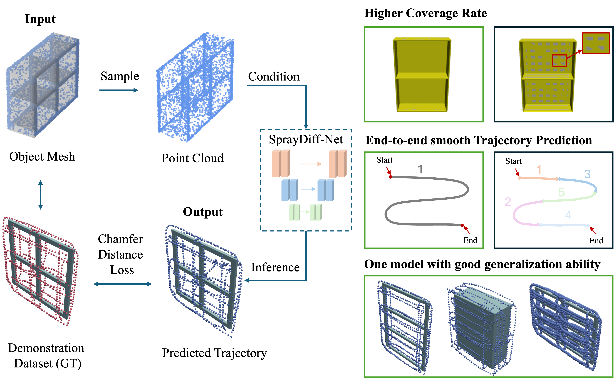

# 3DCov-Diffusion: 3D-Aware Diffusion Policy for Coverage Path Planning

This repository contains the implementation of SprayDiffusion, a diffusion-based approach for robotic spray painting trajectory generation.

## Abstract

Diffusion models, as a class of deep generative models, have recently emerged as powerful tools for robot skills by enabling stable training with reliable convergence, avoiding mode collapse to produce diverse and natural trajectories. In this paper, we present an end-to-end framework for generating long, smooth, and task-consistent trajectories, which are applicable to a wide range of industrial and manipulation settings, such as polishing, robotic painting, and spray-coating. The convention methods are always fundamentally constrained by their pre-defined functional forms, which limit the trajectory shapes they can represent and make it difficult to handle complex and diverse tasks. Moreover, their generalization is poor, often requiring manual redesign or extensive parameter tuning when applied to new scenarios. These limitations highlight the need for more expressive generative models, making diffusion-based approaches a compelling choice for trajectory generation. By iteratively denoising trajectories with carefully designed noise schedules and conditioning mechanisms, diffusion models not only ensure smooth and consistent motion but also flexibly adapt to the task context. In experiments, our method improves trajectory continuity, maintains high coverage, and generalizes to unseen shapes, paving the way for unified end-to-end trajectory learning across industrial surface-processing tasks without category-specific models. On average, our approach improves Point-wise Chamfer Distance by 98.7\% and smoothness by 96.4\%, while increasing surface coverage by 17.3\% compared to prior methods.




## Table of Contents

- [Installation](#installation)
- [Environment Setup](#environment-setup)
- [Quick Start](#quick-start)
- [Core Commands](#core-commands)
- [Dataset Support](#dataset-support)
- [Evaluation Metrics](#evaluation-metrics)
- [Experimental Results](#experimental-results)
- [Visualization](#visualization)
- [Configuration](#configuration)
- [Troubleshooting](#troubleshooting)
- [Citation](#citation)

## Installation

### Prerequisites

- Linux system (tested on Ubuntu)
- CUDA 11.7+ compatible GPU
- Conda package manager
    
### Environment Setup

1. **Clone the repository:**
    ```bash
   git clone git@github.com:crystalccy1/spraydiffusion_ral.git
   cd spraydiffusion_ccy
   ```

2. **Create conda environment:**
   ```bash
   # Create environment from YAML file
   conda env create -f environment.yaml
   
   # Activate the environment
   conda activate spraydiffusion
   ```

3. **Verify installation:**
   ```bash
   # Check Python version
   python --version  # Should be 3.10.18
   
   # Check PyTorch installation
   python -c "import torch; print(f'PyTorch version: {torch.__version__}'); print(f'CUDA available: {torch.cuda.is_available()}')"
   
   # Check PyTorch3D installation
   python -c "import pytorch3d; print(f'PyTorch3D version: {pytorch3d.__version__}')"
   
   # Check other key dependencies
   python -c "import open3d, pyvista, matplotlib, numpy, scipy; print('All dependencies installed successfully')"
   ```

### Key Dependencies

The environment includes the following key packages:

#### Core ML Libraries
- **PyTorch**: 1.13.1+cu117 (with CUDA 11.7 support)
- **PyTorch3D**: 0.7.3 (for 3D operations)
- **NumPy**: 1.26.4
- **SciPy**: 1.15.3

#### 3D Processing
- **Open3D**: 0.19.0 (point cloud processing)
- **PyVista**: 0.46.1 (3D visualization)
- **Trimesh**: 4.7.4 (mesh processing)
- **VTK**: 9.5.0 (visualization toolkit)

#### Visualization
- **Matplotlib**: 3.10.5
- **Plotly**: 6.3.0
- **Seaborn**: 0.13.2

#### Configuration & Utilities
- **OmegaConf**: 2.3.0 (configuration management)
- **Termcolor**: 3.1.0 (colored terminal output)
- **TQDM**: 4.67.1 (progress bars)
- **WandB**: 0.21.1 (experiment tracking)

### GPU Requirements

- **CUDA**: 11.7+ (compatible with PyTorch 1.13.1)
- **GPU Memory**: Minimum 8GB VRAM recommended
- **Driver**: NVIDIA driver compatible with CUDA 11.7

## Quick Start

### 1. Training SprayDiffusion

```bash
# Basic training command
python train_spraydiffusion.py --config windows-v2 --seed 42

# Example: Train on different datasets
python train_spraydiffusion.py --config cuboids-v2 --seed 42
python train_spraydiffusion.py --config shelves-v2 --seed 42
python train_spraydiffusion.py --config containers-v2 --seed 42
```

### 2. Testing SprayDiffusion

```bash
# Test with checkpoint
python test_spraydiffusion.py \
    --checkpoint_path [path_to_checkpoint] \
    --dataset_name windows-v2 \
    --dataset_split test \
    --eval_episodes 20 \
    --run_name test_run \
    --seed 42 \
    --workers 4
```

### 3. Testing PaintNet (Baseline)

```bash
# Test PaintNet only
python test_spraydiffusion_with_paintnet.py \
    --paintnet_only \
    --paintnet_model [path_to_paintnet_model] \
    --dataset_name windows-v2 \
    --dataset_split test \
    --eval_episodes 20 \
    --run_name paintnet_test \
    --seed 42 \
    --workers 4
```

### 4. Training PaintNet

```bash
# Navigate to PaintNet submodule
cd submodules/paintnet

# Train PaintNet
python train.py --config windows-v2 --seed 42
```

## Core Commands

### Training Commands

```bash
# SprayDiffusion training
python train_spraydiffusion.py --config [config_name] --seed 42

# PaintNet training
cd submodules/paintnet
python train.py --config [config_name] --seed 42
```

### Testing Commands

```bash
# SprayDiffusion testing
python test_spraydiffusion.py \
    --checkpoint_path [checkpoint_path] \
    --dataset_name [dataset_name] \
    --dataset_split test \
    --eval_episodes 20 \
    --run_name [run_name] \
    --seed 42 \
    --workers 4

# PaintNet testing
python test_spraydiffusion_with_paintnet.py \
    --paintnet_only \
    --paintnet_model [model_path] \
    --dataset_name [dataset_name] \
    --dataset_split test \
    --eval_episodes 20 \
    --run_name [run_name] \
    --seed 42 \
    --workers 4
```

## Comparison Testing (Both Methods)

```bash
python test_spraydiffusion_with_paintnet.py \
    --spraydiffusion_checkpoint [checkpoint_path] \
    --paintnet_model [model_path] \
    --dataset_name [dataset_name] \
    --comparison_mode
```

## Dataset Support

The system supports the following datasets:

- **windows-v2**: Window objects for spray painting
- **cuboids-v2**: Cuboid objects
- **shelves-v2**: Shelf objects  
- **containers-v2**: Container objects

## Evaluation Metrics

The system evaluates the following metrics:

### Primary Metrics
- **PCD (Point-wise Chamfer Distance)**: Trajectory accuracy
- **Coverage**: Surface coverage percentage
- **Smoothness**: Trajectory smoothness measure

### Performance Metrics
- **Inference Time**: Model inference latency
- **Total Latency**: End-to-end processing time

## Experimental Results

### Comprehensive Comparison Results

The following table shows quantitative results across three metrics: Point-wise Chamfer Distance (PCD), Surface Coverage Rate (Coverage, reported in %), and Smoothness. Values are reported as mean ± standard deviation over three random seeds. Boldface indicates the best-performing method. For PCD and Smoothness, lower is better (↓); for Coverage, higher is better (↑).

| **Model** | **Windows** | | | **Cuboids** | | | **Shelves** | | | **Containers** | | |
|-----------|-------------|---|---|-------------|---|---|-------------|---|---|-------------|---|---|
| | PCD ↓ | Coverage ↑ | Smoothness ↓ | PCD ↓ | Coverage ↑ | Smoothness ↓ | PCD ↓ | Coverage ↑ | Smoothness ↓ | PCD ↓ | Coverage ↑ | Smoothness ↓ |
| **Point-Wise** | 55.71 ± 3.10 | 96.49 ± 0.11% | 2.54 ± 0.00 | 35.47 ± 0.22 | **98.73 ± 0.11%** | 3.50 ± 0.01 | 44.30 ± 0.59 | **92.96 ± 0.02%** | 2.20 ± 0.00 | **313.98 ± 2.47** | **82.86 ± 0.60%** | 1.71 ± 0.03 |
| **Multi-Path** | 264.69 ± 0.43 | 67.54 ± 0.13% | 1.69 ± 0.00 | 297.40 ± 0.27 | 50.66 ± 0.15% | 3.30 ± 0.00 | 491.86 ± 3.29 | 26.05 ± 0.32% | 0.72 ± 0.00 | 1193.45 ± 5.97 | 14.12 ± 0.80% | 0.33 ± 0.01 |
| **PaintNet** | 694.88 ± 76.17 | 63.57 ± 0.16% | 1.37 ± 0.06 | 689.84 ± 1.71 | 11.47 ± 0.14% | 1.32 ± 0.00 | 744.64 ± 3.72 | 16.22 ± 0.80% | 0.26 ± 0.01 | 2621.26 ± 34.64 | 1.54 ± 0.25% | 0.17 ± 0.00 |
| **Ours (SprayDiffusion)** | **10.24 ± 0.49** | **99.65 ± 0.05%** | **0.05 ± 0.01** | **4.82 ± 0.14** | 92.78 ± 0.08% | **0.04 ± 0.01** | **9.01 ± 0.30** | 83.01 ± 0.30% | **0.07 ± 0.01** | 622.16 ± 26.62 | 50.09 ± 1.22% | **0.04 ± 0.01** |

### Key Findings

#### Performance Summary
- **SprayDiffusion (Ours)** achieves the best PCD scores across all datasets, demonstrating superior trajectory accuracy
- **SprayDiffusion** achieves the best smoothness scores across all datasets, indicating highly smooth trajectories
- **Point-Wise** method achieves the highest coverage on Cuboids, Shelves, and Containers datasets
- **SprayDiffusion** achieves the highest coverage on Windows dataset (99.65%)

#### Dataset-Specific Results

**Windows Dataset:**
- SprayDiffusion: PCD 10.24 ± 0.49, Coverage 99.65 ± 0.05%, Smoothness 0.05 ± 0.01
- Point-Wise: PCD 55.71 ± 3.10, Coverage 96.49 ± 0.11%, Smoothness 2.54 ± 0.00
- Multi-Path: PCD 264.69 ± 0.43, Coverage 67.54 ± 0.13%, Smoothness 1.69 ± 0.00
- PaintNet: PCD 694.88 ± 76.17, Coverage 63.57 ± 0.16%, Smoothness 1.37 ± 0.06

**Cuboids Dataset:**
- SprayDiffusion: PCD 4.82 ± 0.14, Coverage 92.78 ± 0.08%, Smoothness 0.04 ± 0.01
- Point-Wise: PCD 35.47 ± 0.22, Coverage 98.73 ± 0.11%, Smoothness 3.50 ± 0.01
- Multi-Path: PCD 297.40 ± 0.27, Coverage 50.66 ± 0.15%, Smoothness 3.30 ± 0.00
- PaintNet: PCD 689.84 ± 1.71, Coverage 11.47 ± 0.14%, Smoothness 1.32 ± 0.00

**Shelves Dataset:**
- SprayDiffusion: PCD 9.01 ± 0.30, Coverage 83.01 ± 0.30%, Smoothness 0.07 ± 0.01
- Point-Wise: PCD 44.30 ± 0.59, Coverage 92.96 ± 0.02%, Smoothness 2.20 ± 0.00
- Multi-Path: PCD 491.86 ± 3.29, Coverage 26.05 ± 0.32%, Smoothness 0.72 ± 0.00
- PaintNet: PCD 744.64 ± 3.72, Coverage 16.22 ± 0.80%, Smoothness 0.26 ± 0.01

**Containers Dataset:**
- SprayDiffusion: PCD 622.16 ± 26.62, Coverage 50.09 ± 1.22%, Smoothness 0.04 ± 0.01
- Point-Wise: PCD 313.98 ± 2.47, Coverage 82.86 ± 0.60%, Smoothness 1.71 ± 0.03
- Multi-Path: PCD 1193.45 ± 5.97, Coverage 14.12 ± 0.80%, Smoothness 0.33 ± 0.01
- PaintNet: PCD 2621.26 ± 34.64, Coverage 1.54 ± 0.25%, Smoothness 0.17 ± 0.00

## Visualization

The system generates several types of visualizations:

### 1. Trajectory Visualizations
- **Predicted Trajectory**: Blue trajectory points
- **Ground Truth Trajectory**: Red trajectory points
- **Mesh Overlay**: 3D object mesh with trajectory overlay

### 2. Coverage Visualizations
- **Coverage Heatmap**: Surface coverage visualization
- **Multi-view Rendering**: Multiple camera angle views

### 3. Paper Visualizations
- **Static PNGs**: High-quality images for paper figures
- **Denoising Process**: GIF animations showing diffusion process

## Configuration

### SprayDiffusion Configs
Located in `configs/spraydiffusion/`:
- Dataset-specific configurations
- Model architecture settings
- Training parameters

### PaintNet Configs
Located in `submodules/paintnet/configs/`:
- Lambda parameter configurations
- Training hyperparameters
- Dataset specifications

### Output Structure

```
outputs/
├── demo/
│   └── [run_name]/
│       └── episode_[XXX]_Pred_Cond/
│           ├── trajectory_ep[X]_pred.png
│           ├── trajectory_ep[X]_gt.png
│           └── coverage_ep[X].png
└── paper_vis/
    └── [dataset_name]/
        └── [run_name]/
            ├── episode_[XXX]_pred_mesh.png
            ├── episode_[XXX]_gt_mesh.png
            └── episode_[XXX]_pred_gt_mesh.png
```

## Troubleshooting

### Common Issues

1. **CUDA Version Mismatch**
    ```bash
   # Check CUDA version
   nvidia-smi
   
   # If CUDA version is different, reinstall PyTorch
   pip install torch==1.13.1+cu117 torchvision==0.14.1+cu117 torchaudio==0.13.1+cu117 --index-url https://download.pytorch.org/whl/cu117
   ```

2. **PyTorch3D Installation Issues**
   ```bash
   # Reinstall PyTorch3D
   pip uninstall pytorch3d
   pip install "git+https://github.com/facebookresearch/pytorch3d.git"
   ```

3. **Open3D Import Errors**
    ```bash
   # Reinstall Open3D
   pip uninstall open3d
   pip install open3d==0.19.0
   ```

4. **CUDA Out of Memory**
   - Reduce batch size
   - Use gradient checkpointing
   - Process fewer episodes

5. **Dataset Loading Errors**
   - Check dataset paths
   - Verify data format
   - Ensure proper permissions

6. **Model Loading Issues**
   - Verify checkpoint paths
   - Check model compatibility
   - Ensure proper state dict loading

### Debug Mode

```bash
# Run with debugger
python -m pdb test_spraydiffusion.py [arguments]

# Enable verbose logging
python test_spraydiffusion.py [arguments] --verbose
```

### Environment Verification Script

Create and run this script to verify your installation:

```python
#!/usr/bin/env python3
"""Environment verification script"""

def check_imports():
    """Check if all required packages can be imported"""
    packages = [
        'torch', 'torchvision', 'torchaudio',
        'pytorch3d', 'open3d', 'pyvista', 'trimesh',
        'matplotlib', 'numpy', 'scipy', 'pandas',
        'omegaconf', 'termcolor', 'tqdm', 'wandb'
    ]
    
    failed_imports = []
    for package in packages:
        try:
            __import__(package)
            print(f"SUCCESS: {package}")
        except ImportError as e:
            print(f"FAILED: {package}: {e}")
            failed_imports.append(package)
    
    if failed_imports:
        print(f"\nFailed imports: {failed_imports}")
        return False
    else:
        print("\nAll packages imported successfully!")
        return True

def check_cuda():
    """Check CUDA availability"""
    import torch
    print(f"CUDA available: {torch.cuda.is_available()}")
    if torch.cuda.is_available():
        print(f"CUDA version: {torch.version.cuda}")
        print(f"GPU count: {torch.cuda.device_count()}")
        for i in range(torch.cuda.device_count()):
            print(f"GPU {i}: {torch.cuda.get_device_name(i)}")

if __name__ == "__main__":
    print("Checking environment setup...")
    check_imports()
    check_cuda()
```

## Statistical Analysis

### Multiple Test Runs
Each experiment is run 3 times with different seeds (42, 1001, 2002) to ensure statistical significance.

### Statistical Measures
- **Mean**: Average performance across runs
- **Standard Deviation**: Measure of variance
- **Confidence Intervals**: 95% confidence intervals for mean estimates

## Performance Comparison

### Comprehensive Method Comparison

#### SprayDiffusion (Ours) vs Baselines
- **Trajectory Quality (PCD)**: SprayDiffusion achieves the best PCD scores across all datasets, demonstrating superior trajectory accuracy
- **Smoothness**: SprayDiffusion consistently achieves the best smoothness scores across all datasets
- **Coverage**: Mixed results - SprayDiffusion achieves highest coverage on Windows (99.65%), while Point-Wise achieves highest coverage on Cuboids (98.73%), Shelves (92.96%), and Containers (82.86%)

#### Method-Specific Strengths
- **SprayDiffusion**: Best overall trajectory quality and smoothness, excellent coverage on Windows
- **Point-Wise**: Best coverage on Cuboids, Shelves, and Containers datasets
- **Multi-Path**: Moderate performance across all metrics
- **PaintNet**: Generally poor performance across all metrics, with very low coverage rates

## Reproducibility

### Random Seeds
- All experiments use fixed seeds for reproducibility
- Training: seed=42
- Testing: seeds 42, 1001, 2002

### Environment
- Use the provided `environment.yaml` for consistent setup
- All package versions are pinned for reproducibility

## Citation

If you use this code in your research, please cite:

```bibtex
@article{spraydiffusion2024,
  title={SprayDiffusion: Diffusion-based Robotic Spray Painting Trajectory Generation},
  author={[Authors]},
  journal={IEEE Robotics and Automation Letters},
  year={2024}
}
```

## Repository Structure

```
spraydiffusion_ccy/
├── README.md
├── environment.yaml
├── requirements.txt
├── train_spraydiffusion.py
├── test_spraydiffusion.py
├── test_spraydiffusion_with_paintnet.py
├── configs/
│   └── spraydiffusion/
│       ├── ablation/
│       ├── containers_v2.yaml
│       ├── cuboids_v2.yaml
│       ├── default.yaml
│       ├── dp3.yaml
│       ├── shelves_v2.yaml
│       └── windows_v2.yaml
├── handlers/
│   ├── loss_handler.py
│   ├── loss_spraydiffusion_handler.py
│   ├── metrics_handler.py
│   ├── metrics_handler_spraydiffusion.py
│   └── spraydiffusion_metrics_handler.py
├── models/
│   ├── 3d_diffsuion_model.py
│   ├── dgcnn.py
│   ├── point_transformer.py
│   ├── pointnet.py
│   └── pointnet2_*.py
├── scripts/
│   └── create_replay_buffer.py
├── spray_diffusion/
│   ├── common/
│   ├── dataset/
│   ├── env/
│   ├── env_runner/
│   ├── gym_util/
│   ├── model/
│   │   ├── common/
│   │   ├── diffusion/
│   │   └── vision/
│   └── policy/
├── utils/
│   ├── dataset/
│   ├── metrics/
│   ├── visualize.py
│   └── config.py
└── submodules/
    └── paintnet/
        ├── configs/
        ├── models/
        ├── train.py
        └── torch-nndistance/
```


## Acknowledgments

We acknowledge the contributions of the research community and the open-source projects that made this work possible.
